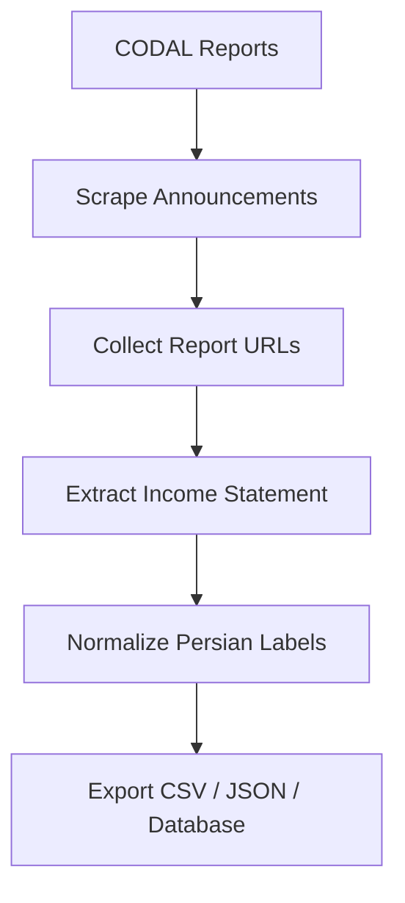

# Architecture Overview

This project extracts CODAL financial report data and converts raw report pages into clean structured output.

## Pipeline Summary

1. Collect public financial announcements from CODAL.
2. Open report pages and extract income statement data.
3. Use embedded JSON when available.
4. Fall back to HTML table parsing when needed.
5. Normalize Persian financial labels into English fields.
6. Export clean structured data.